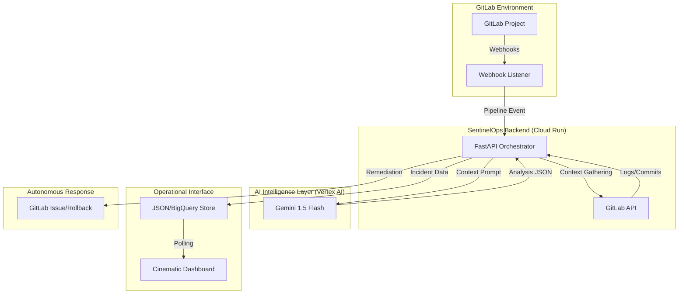

# SentinelOps AI: Architecture Overview

SentinelOps AI follows a modular, cloud-native architecture designed for high availability and autonomous reasoning.

## 🏗 System Architecture Diagram

## 🧩 Component Breakdown

### 1. Webhook Listener (FastAPI)
- Handles high-concurrency event ingestion from GitLab.
- Validates payload integrity and routes events to the Analyzer.

### 2. Incident Brain (Gemini 1.5 Flash)
- Executes complex reasoning over unstructured logs and commit history.
- Performs Root Cause Analysis (RCA) and generates executive impact summaries.

### 3. Cinematic Dashboard (Frontend)
- Built with Vanilla JS/CSS for ultra-responsive performance.
- Features real-time metric animations and incident timeline visualization.

### 4. Action Engine
- Integrates with GitLab API to automate the creation of incident issues and rollback recommendations.

## ☁️ Google Cloud Integration
- **Vertex AI:** Core reasoning and analysis.
- **Cloud Run:** Scalable backend hosting.
- **Cloud Logging:** System observability.
- **BigQuery:** Long-term incident analytics (Roadmap).
