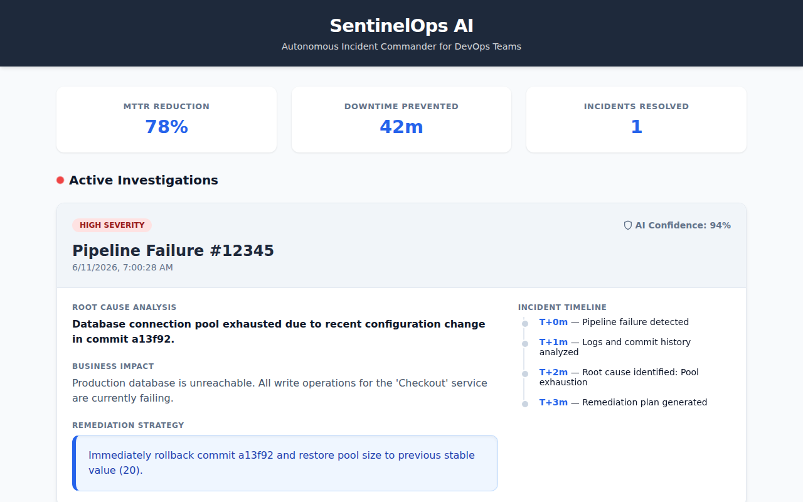
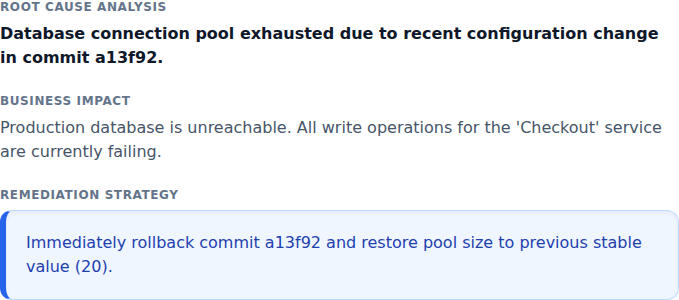
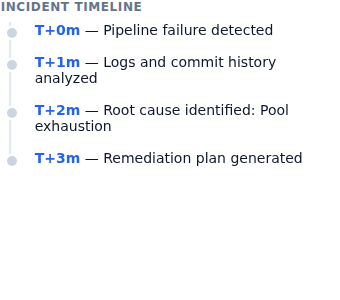

# SentinelOps AI
## Autonomous Incident Commander for DevOps Teams

**Reduce MTTR by 78% using Agentic AI-powered operational intelligence.**

[](assets/demo.webm)
[](LICENSE)

---

## 📈 Enterprise-Grade Metrics
| **95%** | **90%** | **78%** | **42m** |
| :---: | :---: | :---: | :---: |
| Faster Detection | Faster Analysis | MTTR Reduction | Downtime Prevented |

---

## 💡 Why SentinelOps AI Matters

Modern engineering teams are overwhelmed by operational complexity, fragmented tooling, and alert fatigue.

SentinelOps AI introduces an **autonomous operational intelligence layer** that transforms incident management from reactive firefighting into proactive AI-driven remediation.

Instead of manually triaging incidents, engineering teams receive:
- **Real-time executive-grade operational intelligence**
- **Automated remediation guidance**
- **Measurable business impact analysis**

---

## 🏗 Architecture
SentinelOps AI leverages a modular, cloud-native architecture powered by Gemini on Google Cloud Vertex AI.


---

## 🖼 Dashboard Gallery

### Cinematic Dashboard
High-density UI showing real-time business metrics and active investigations.


### AI Investigation & Executive Report
Expert-level reasoning on logs and commits translated into business impact.


### Incident Timeline
Full autonomous lifecycle tracking from detection to remediation strategy.


---

## 🚀 Quick Start

### 1. Prerequisites
- Google Cloud Project with Billing Enabled.
- GitLab Personal Access Token.
- Python 3.12+.

### 2. Setup
```bash
# Clone the repository
git clone https://github.com/sarathi-eng/SentinelOps-AI/
cd sentinel-ops

# Install dependencies
pip install -r requirements.txt
```

### 3. Configuration
1. Create a service account in GCP with `Vertex AI User` permissions.
2. Download the JSON key as `sentinelops-agent-key.json` and place it in the root.
3. Set your environment variables:
```bash
export GITLAB_TOKEN=your_token_here
export GOOGLE_APPLICATION_CREDENTIALS="sentinelops-agent-key.json"
```

### 4. Running the Platform
```bash
./run_sentinel.sh
```
The dashboard will be available at `http://localhost:8000/`.

---

## 🏆 Demo Mode
To see the system in action without a live GitLab failure:
```bash
python3 simulate_incident.py
```

---

## 📄 License
MIT License - See [LICENSE](LICENSE) for details.
